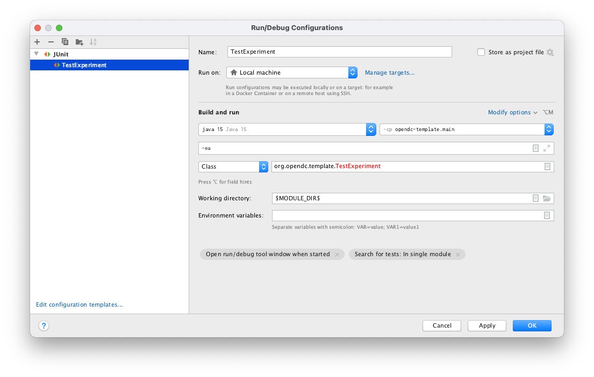

# OpenDC Template
This repository contains a template for creating external extensions and experiments using OpenDC.
Use this as a starting point when developing new experiments and concepts for OpenDC.

## Project Setup
The OpenDC simulator is built using the [Kotlin](https://kotlinlang.org/) language. This is a JVM-based language that
should appear familiar to programmers knowledgeable in Java or Scala. For a short interactive introduction to Kotlin,
the [Learn Kotlin By Example](https://play.kotlinlang.org/byExample/overview) docs are a great place to start.

For the build and dependency toolchain, we use [Gradle](https://gradle.org/). You will likely not need to change the
Gradle build configurations of components, but you will use Gradle to execute builds and tests on the codebase.

### Forking the Repository

Before you start, first create a fork (or copy) of the repository either locally or on GitHub which you can use as a
starting point for your new project.

### Installing Java

Kotlin requires a Java installation of version 8 or higher. Make sure to install
the [JDK](https://www.oracle.com/technetwork/java/javase/downloads/index.html), not only the JRE (the JDK also includes
a JRE).

### Setup with IntelliJ IDEA

We suggest using [IntelliJ IDEA](https://www.jetbrains.com/idea/) as development environment. Once you have installed
and opened IntelliJ on your machine, choose "Get from Version Control" in the new project dialogue.
Enter the URL of your fork of the repository and submit your credentials when asked.
Open the project once it's ready fetching the codebase, and let it set up with the defaults (IntelliJ will recognize
that this is a Gradle codebase).

You will now be prompted in a dialogue to enable auto-import for Gradle, which we suggest you do. Wait for any progress
bars in the lower bar to disappear and then look for the Gradle context menu on the right-hand side. In it, go
to `opendc > Tasks > Build > build`. This will build the repository and generate the artifacts necessary to run experiments.

### Running Experiments with IntelliJ IDEA

To accelerate development, OpenDC offers the possibility to run experiments directly inside IntelliJ IDEA
(using `opendc-harness-junit5`). In order to set up this functionality, go to `Run > Edit Configurations` and create a
new JUnit configuration pointing to any class that extends `org.opendc.harness.dsl.Experiment` 
(in our template, `org.opendc.template.TestExperiment`). See the image below for reference:



You can now directly run the experiment from your IDE. While this approach allows for quick prototyping, it does not
offer the same flexibility and performance as running the experiments using the command-line experiment runner.

### Running Experiments with CLI 

Alternatively, you may run the experiments in your command prompt using the OpenDC command-line experiment runner. This
approach provides the most flexibility and the best performance.

To get the command-line experiment runner, download one of the [OpenDC releases](https://github.com/atlarge-research/opendc/releases)
and verify that the included experiment runner works:
```bash
PATH_TO_RELEASE/bin/opendc-harness -h
```

Before we can run the experiments using the command-line runner, we must first package the experiments. This can be done
as follows:
```bash
./gradlew shadowJar
```
This will generate a Jar file at `build/libs/opendc-template-all.jar` which contains the experiments in this repository 
as well as the dependencies necessary to run the experiments.

You may then run the experiments as follows:
```bash
PATH_TO_RELEASE/bin/opendc-harness --class-path build/libs/opendc-template-all.jar org.opendc.template.TestExperiment
```

## License
This repository is made available under the MIT license. See [LICENSE.txt](/LICENSE.txt).